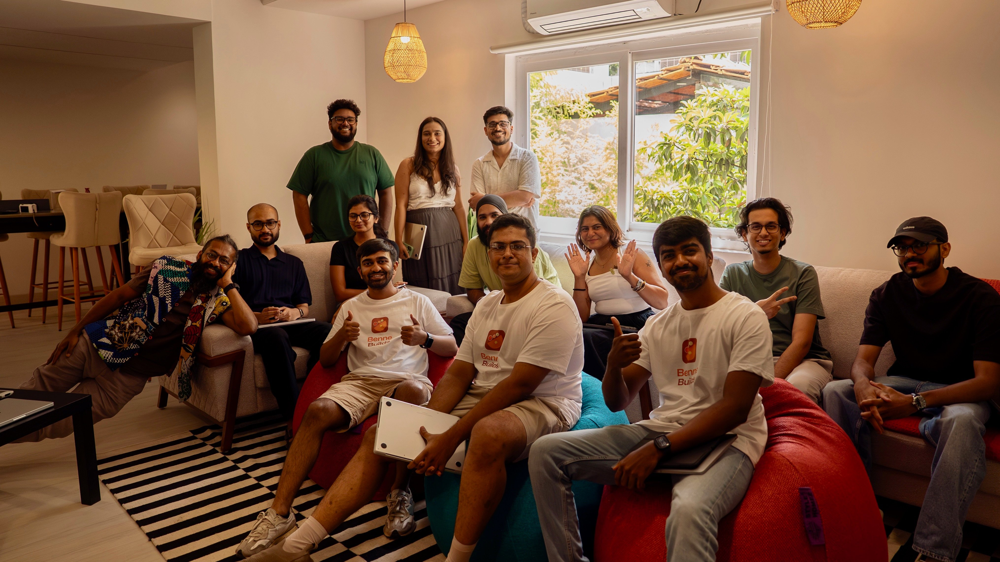
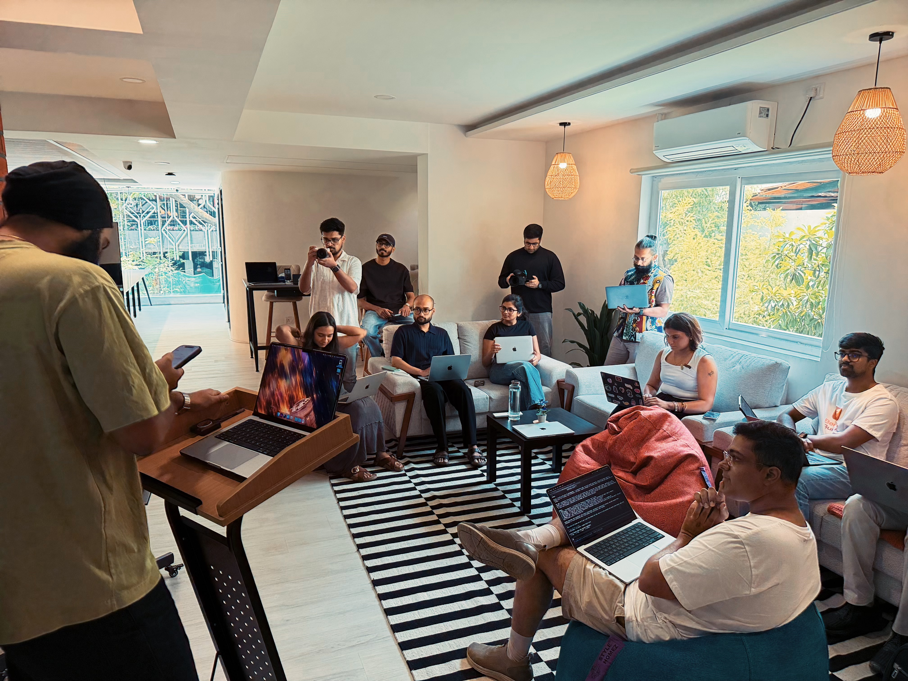
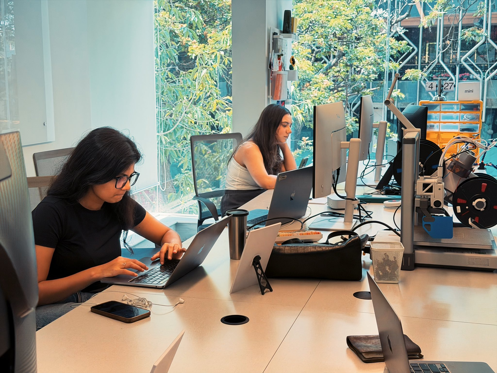
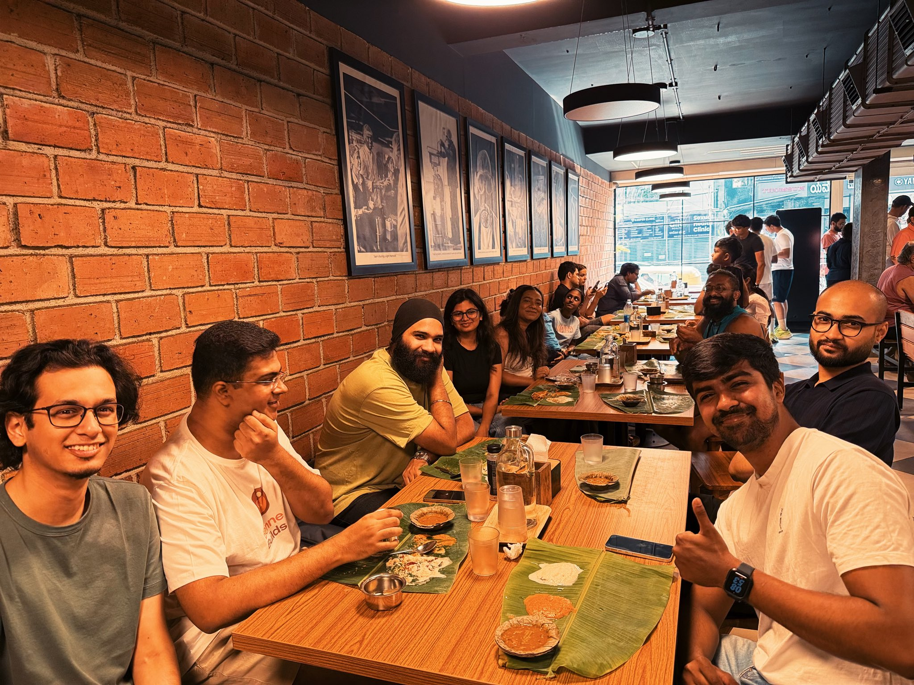

# 🧈 Benne Builds

## 📚 Table of Contents

- [Introduction](#-introduction)
- [Editions](#-editions)
- [Photos](#-photos)
- [Manifesto](#-manifesto)
- [Social Media](#-social-media)

## 🌱 Introduction

**👋 Introducing Benne Builds!**

**Swift Bengaluru's Special Build Meetup**

Benne Builds is a SwiftBengaluru special build meetup for people who love building in the Apple Developer Ecosystem.

It is not limited to developers. We are opening the room to designers, makers, and builders who care about Apple platforms, AI, craft, and good demos.

### 👥 The Team

All editions are led by the same team of three members.

| Member          | Role                                     | X                                               |
| --------------- | ---------------------------------------- | ----------------------------------------------- |
| Sabesh Bharathi | Benne Builds Ambassador                  | [@sabeshbharathi](https://x.com/sabeshbharathi) |
| Gokul Boopathy  | Swift Bengaluru Core Team Member - UHNWI | [@gokulboopathy](https://x.com/gokulboopathy)   |
| Raj Raval       | Swift Bengaluru Core Team Member         | [@rajhraval](https://x.com/rajhraval)           |

### ☕ The Plan

Our plan is simple: wake up early, start the day at a great dosa spot, fuel up with filter coffee ☕️, and then spend 1-2 focused hours building with AI alongside friends.

After the build session, everyone demos what they made. The demos from each edition will be published soon on this GitHub repository.

### 🎯 Our Goal

Our goal is to create builders, encourage a builder mindset, and bring out the best in developers and designers building for Apple Developer Platforms.

### 🚀 First Of Many

This is the first of many. Going forward, we will announce each event beforehand, explore newer dosa spots across Bengaluru, and keep the guest list exclusive and curated.

### 🌈 Curated Community Commitment

Every edition will bring together a thoughtful mix of builders from across the Apple Developer Ecosystem.

- 🎨 **Designers**
- 🍎 **Swift Bengaluru Patrons**
- 🎓 **Student Patrons**
- 👩‍💻 **Atleast 40%+ Women Representation**

### 📖 Story Behind Benne Builds

## 🗂️ Editions

- [Edition 0: BenneBuilds - The Beginning](BenneBuilds%20-%20The%20Beginning/BenneBuilds-TheBeginning.md)

## 📸 Photos

|                    |                    |
| ------------------ | ------------------ |
|  |  |
|  |  |

## 📜 Manifesto

Benne Builds is a voluntary movement for the people building in AI in Bengaluru.

It is a space for builders working with AI, Apple platforms, demos, experiments, and ideas worth sharing.

### 🚀 What We Stand For

#### 🤖 **We build with AI.**

This is the moat. Models, agents, AI-accelerated development, whatever shape it takes. If you're shipping something powered by or built on top of AI, this is your room.

#### 🍎 **We build for Apple platforms.**

Swift, SwiftUI, the whole stack. iOS, macOS, visionOS, wherever Apple goes next. On-device intelligence is the future and we're building it here.

#### 🎤 **We demo.**

Bring the thing you're working on. Half-baked is welcome. Broken is welcome. The point is to put it on the table and talk about it like adults who care.

#### 📚 **We learn.**

Every person who walks out should be carrying something new. A model, a feature, a syntax, a sharper way of thinking. One new thing per head, every time. That's the whole bet.

#### 🧈 **We stay smooth.**

Like benne 🧈. Generous by default. Easy to work with. Quick to share, slow to gatekeep.

#### 🤝 **We give back.**

Everything we know was taught to us by someone, somewhere. Benne Builds is how we pay it forward.

### 💌 The Invitation

- Show up.
- Show your work.
- Take something home.
- Bring someone with you next time.

**This is how a building culture gets built.**

## 🌐 Social Media

| Platform    | Link                                                                                                      |
| ----------- | --------------------------------------------------------------------------------------------------------- |
| X / Twitter | [Swift Bengaluru](https://x.com/SwiftBengaluru)                                                           |
| Instagram   | [@swiftbengaluru](https://www.instagram.com/swiftbengaluru/)                                              |
| LinkedIn    | [Swift Bengaluru](https://www.linkedin.com/company/swiftbengaluru/)                                       |
| WhatsApp    | [Join the Swift Bengaluru WhatsApp community](https://chat.whatsapp.com/KEJYYVVgYY09C7keqoLvMq?mode=gi_t) |
